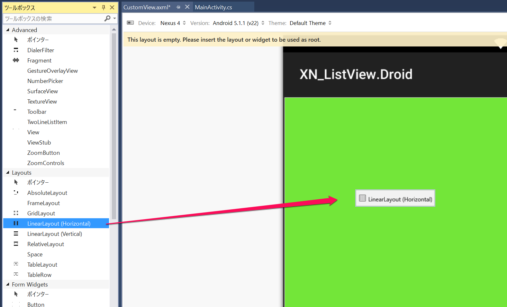
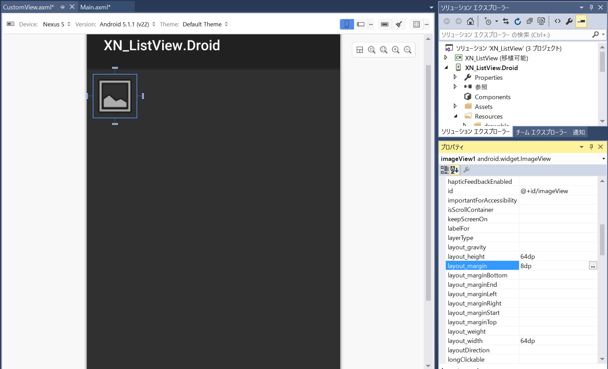
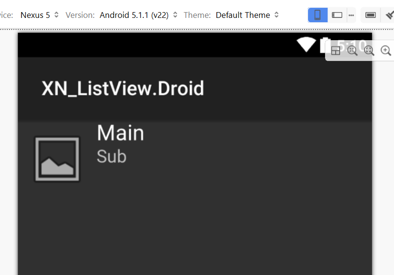

# CustomViewの作成

ListViewで使用するCustomViewを作成していきます。

CustomView.axmlを開きます。標準のLinearLayoutを削除し、［ツールボックス］からLinearLayout (Horizontal)をドラッグ＆ドロップして配置します。    


続いてImageViewをドラッグ＆ドロップして配置します。

ImageViewの［Id］を **@+id/imageView** に指定し、［layout_width］と［layout_height］をそれぞれ **64dp** に、［layout_margin］を **8dp** に指定します。    


次にLinearLayout (Vertical)をドラッグ＆ドロップしてImageViewの右側に配置します。

配置したLinearLayoutにText (Large)を配置し、［Id］を **@+id/mainText** に、［Text］を **Main** に変更します。

配置したTextViewの下にText (Medium)を配置し、［Id］を **@+id/SubText** に、［Text］を **Sub** に変更します。


Layout、Viewは今回のようにデザイナーで作成していく事も可能ですし、XMLを直接記述することも可能です。左下の［ソース］タブを開いてください。次のようなViewのXMLが記載されているはずです。

```xml
<?xml version="1.0" encoding="utf-8"?>
<LinearLayout xmlns:p1="http://schemas.android.com/apk/res/android"
    p1:orientation="horizontal"
    p1:minWidth="25px"
    p1:minHeight="25px"
    p1:layout_width="match_parent"
    p1:layout_height="match_parent"
    p1:id="@+id/linearLayout1">
    <ImageView
        p1:src="@android:drawable/ic_menu_gallery"
        p1:layout_width="64dp"
        p1:layout_height="64dp"
        p1:id="@+id/imageView"
        p1:layout_margin="8dp" />
    <LinearLayout
        p1:orientation="vertical"
        p1:layout_width="wrap_content"
        p1:layout_height="match_parent"
        p1:id="@+id/linearLayout2">
        <TextView
            p1:text="Main"
            p1:textAppearance="?android:attr/textAppearanceLarge"
            p1:layout_width="match_parent"
            p1:layout_height="wrap_content"
            p1:id="@+id/mainText" />
        <TextView
            p1:text="Sub"
            p1:textAppearance="?android:attr/textAppearanceMedium"
            p1:layout_width="match_parent"
            p1:layout_height="wrap_content"
            p1:id="@+id/subText" />
    </LinearLayout>
</LinearLayout>
```

[CustomAdapterの追加](./03.AddCustomAdapter.md)に移りましょう。
