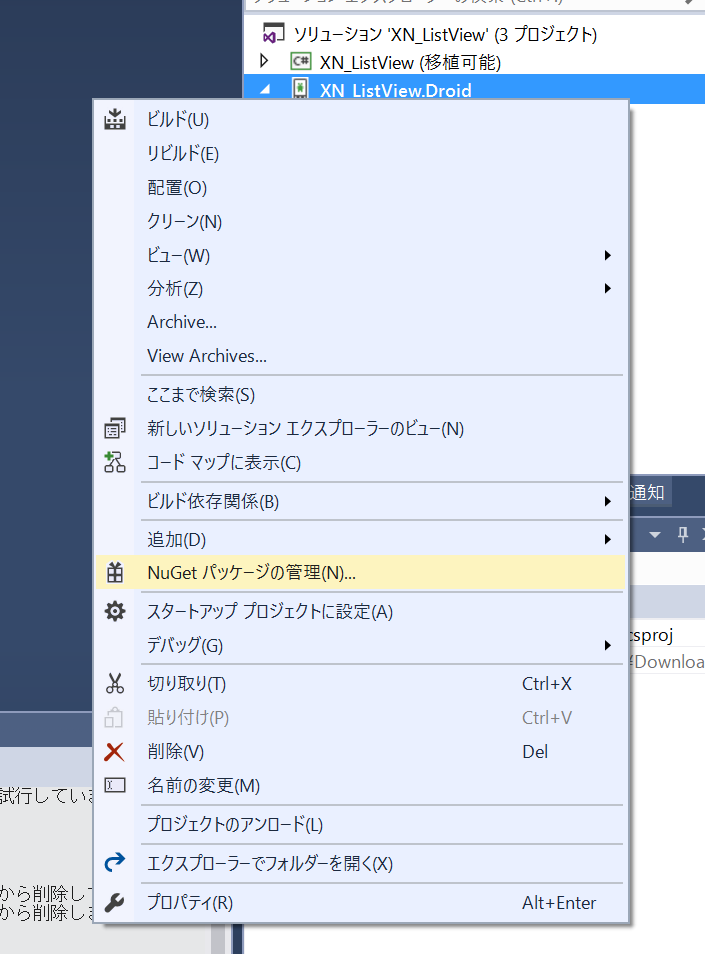
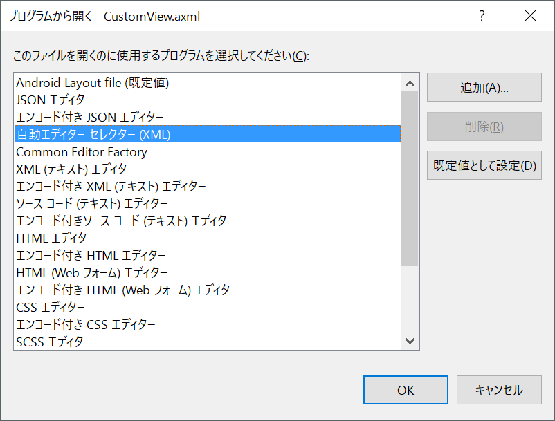
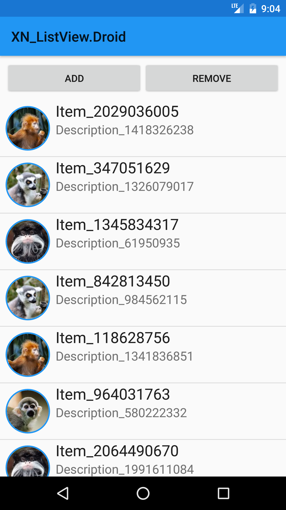

# 画像を丸く

XamarinのAndroid開発では、Visual StudioでのWPFやUWPの開発と同じように、Visual Studio上で [NuGet](http://nuget.org) から必要なライブラリをインストールして使用します。

画像を丸くするライブラリ [CircleImageView](https://github.com/hdodenhof/CircleImageView) をXamarin.Android用にフォークした [CircleImageView-Xamarin.Android ](https://github.com/jamesmontemagno/CircleImageView-Xamarin.Android) を使用してみましょう。

Androidプロジェクトを右クリックして、**NuGet パッケージの管理** をクリックします。    


［参照］タブをクリックして、`Refractored.Controls.CircleImageView` を検索し、インストールします。    


`CustomView.axml` を右クリックして、**ファイルを開くアプリケーションの選択** をクリックすると表示されるダイアログで **自動エディター付きセレクター** を選択します。    


次のように、ImageViewの置き換え、xmlnsの追加、CircleImageViewのプロパティの追加を行います。

```xml
<refractored.controls.CircleImageView
  xmlns:app="http://schemas.android.com/apk/res-auto"
  p1:src="@android:drawable/ic_menu_gallery"
  p1:layout_width="64dp"
  p1:layout_height="64dp"
  p1:id="@+id/imageView"
  p1:layout_margin="8dp"
  app:civ_border_width="1dp"
  app:civ_border_color="#FF2196F3"/>
```

再度ビルドしてしてEmulatorで動作を確認してください。



お疲れさまでした！ハンズオンは以上です。
